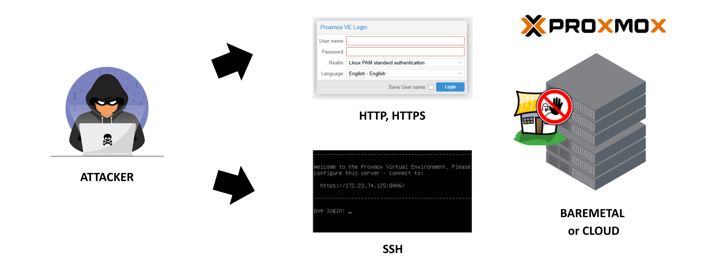

## Overview

<p align="center">

</p>

### Information

Fail2Ban is an open-source intrusion prevention framework that protects Linux servers from brute-force attacks by monitoring log files (e.g., SSH, Apache) for malicious activity. It automatically updates firewall rules (iptables/nftables) to ban IP addresses that exhibit suspicious behavior, such as too many failed login attempts

### Tested Version

* Proxmox Virtualizaztion Environment 8.3

### Issue Bruteforce

* Bruteforce SSH (Port 22)
* Bruteforce Login Pages (HTTP, HTTPS, Port 8006)

## Installing
```
```

## Running
```
```

## Verification

Status Fail2ban
```
systemctl status fail2ban
```

Log Monitoring Fail2ban
```
tail -f /var/log/fail2ban.log
```

## Testing
```
```

## Unban IP 

Unban status SSH
```
root@pve:~# fail2ban-client status sshd
Status for the jail: sshd
|- Filter
|  |- Currently failed: 0
|  |- Total failed:     5
|  `- Journal matches:  _SYSTEMD_UNIT=sshd.service + _COMM=sshd
`- Actions
   |- Currently banned: 1
   |- Total banned:     1
   `- Banned IP list:   10.13.3.55
root@pve:~# 
```

Unban IP for SSH
```
fail2ban-client set sshd unbanip 10.13.3.55
```

Unban status Proxmox
```
root@pve:~# fail2ban-client status proxmox
Status for the jail: proxmox
|- Filter
|  |- Currently failed: 0
|  |- Total failed:     6
|  `- Journal matches:
`- Actions
   |- Currently banned: 1
   |- Total banned:     2
   `- Banned IP list:   10.13.3.55
root@pve:~# 
```

Unban IP for HTTP, HTTPS
```
fail2ban-client set proxmox unbanip 10.13.3.55
```

## Support

* [:octocat: Follow me on GitHub](https://github.com/anggrdwjy)
* [🔔 Subscribe me on Youtube](https://www.youtube.com/@anggarda.wijaya)
  
### Bug

Please open an issue on GitHub with as much information as possible if you found a bug.
* Your Proxmox and Fail2ban Version
* All the logs and message outputted
* etc
